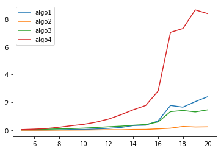
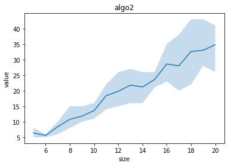
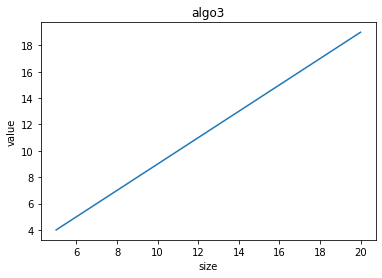

# L’introduction

Le problème des mariages stables est au cœur de nombreuses procédures d'affectation, la plus connue en France étant probablement ParcourSup. Il y a dans ce problème deux types de joueurs (hommes/femmes, candidat(e)s/universités, ...), chaque joueur d'un type donnant ses préférences sur les joueurs de l'autre type (les universités classent les candidat(e)s par exemple). Le but est de trouver une affectation/un couplage vérifiant une propriété de stabilité.
L'algorithme le plus connu pour trouver une telle affectation est l'algorithme de Gale-Shapley. Nous nous intéressons dans ce projet non seulement coder les solutions en algorithme de Gale-Shapley et programmation linéaire, mais aussi étudier ce problème dans une situation dynamique : à chaque pas de temps nous réinitialise le nombre de l’homme et femme et on va trouvé une algorithme qui minimiser le changement de couples. 


# Different algorithmes used
- Gale-shapley (algo 1,2)
- Iteratif linear programmation
- Global linear programmation
    

# Description of files
- name_female.json, name_femal.json / csv : data of humans' name
- get_csv.py : turn files from json to csv
- gs.py : principal code of algorithmes Gale-shapley
- sm.py : principal file contains functions:
    - gennere_set_f_m
    - genere_pref_dyn
    - genere_instance 
    - calcul_difference_entre_gen
    - algo_1 
    - algo_2
    - lire_entree
    - choix_algo
- moplex.py, moplex_new.py : application of linear programmtion
- algo3.py : contains the function for the Iteratif linear programmation
- algo4.py : contains the function for the Global linear programmation


```python
import os 
#if you want to know current working dir
os.getcwd()
#if you want to change
os.chdir('/Users/xinyuhuangmac/Google Drive/M1S2/Projet_SM')
# if you want to list dir
os.listdir()
```


    ['mogplex_new.py',
     'name_male.json',
     '.DS_Store',
     'study_test.py',
     'Untitled.ipynb',
     'tt.py',
     'mogplex.py',
     'trash',
     'algo3.py',
     '__pycache__',
     'sm.py',
     'test.py',
     'name_male.csv',
     'algo4.py',
     'projet_sm.zip',
     'gs.py',
     'donne.csv',
     '.ipynb_checkpoints',
     'name_female.json',
     '.git',
     'main.py',
     'name_female.csv',
     'get_csv.py']


```python
import os
from sm import *
import random
import time
import matplotlib.pyplot as plt
```


```python


size_K=20
size_S=20


lt1,lt2,lt3,lt4=[],[],[],[]
lv1,lv2,lv3,lv4=[],[],[],[]

nb_for_generation=5
for i in range(5,(size_S+1)):
    K=[i]*i
    S=[j for j in range(1,i+1)]
    
    t=[0]*4
    sl1, sl2, sl3 ,sl4 = [], [], [], []
    import sys
    save_stdout = sys.stdout
    sys.stdout = open('trash', 'w')
    for j in range(nb_for_generation):
        female,male,s_f,s_m=gennere_set_f_m(i,i)
        ins=genere_instance(K,S, male, female, s_m, s_f)
        start = time.time()
        res1=calcul_difference_entre_gen(algo_1(deepcopy(ins)))
        stop = time.time()
        t[0]+=stop-start
        start = time.time()
        res2=calcul_difference_entre_gen(algo_2(deepcopy(ins)))
        stop = time.time()
        t[1]+=stop-start
        start = time.time()
        res3=calcul_difference_entre_gen(algo_3(deepcopy(ins)))
        stop = time.time()
        t[2]+=stop-start
        start = time.time()
        res4=prog_lineaire_advance(deepcopy(ins))
        stop = time.time()
        t[3]+=stop-start
        sl1.append(res1)
        sl2.append(res2)
        sl3.append(res3)
        sl4.append(res4)
    sys.stdout = save_stdout
    print("i==",i)
    lv1.append(sl1)
    lv2.append(sl2)
    lv3.append(sl3)
    lv4.append(sl4)
    lt1.append(np.mean(t[0]))
    lt2.append(np.mean(t[1]))
    lt3.append(np.mean(t[2]))
    lt4.append(np.mean(t[3]))

"""
1. codes utilisables (commente, readme, facilise pour l'utilisation->interface)
2. test
    n = 4
    homme=max femme=range(1,max)
    1) temps de calcul en fonction de n (courbe temps de calcul)
    2) valeurs des algorithme alg1/alg4 .....
        - moyenne, pire cas, courbe en fonction de n
    3) ALGO4:
        xijt en reel ->relaxation continue

    18 mai/23,24 mai
"""
```

    i== 5
    i== 6
    i== 7
    i== 8
    i== 9
    i== 10
    i== 11
    i== 12
    i== 13
    i== 14
    i== 15
    i== 16
    i== 17
    i== 18
    i== 19
    i== 20


    'print(lv1)\nplt.plot(S,lt1, label="algo1")\nplt.plot(S,lt2, label="algo1")\nplt.plot(S,lt3, label="algo1")\nplt.plot(S,lt4, label="algo1")\nplt.legend()\nplt.show()\n'


```python
Lg=[i for i in range(5,(size_S+1))]
plt.plot(Lg,lt1, label="algo1")
plt.plot(Lg,lt2, label="algo2")
plt.plot(Lg,lt3, label="algo3")
plt.plot(Lg,lt4, label="algo4")
plt.legend()
plt.show()
```


    

    


```python
plt.plot(Lg,np.mean(lv1,axis=1), label="algo1")
plt.plot(Lg,np.mean(lv2,axis=1), label="algo2")
plt.plot(Lg,np.mean(lv3,axis=1), label="algo3")
plt.plot(Lg,np.mean(lv4,axis=1), label="algo4")
plt.legend()
plt.show()
```


    

    


```python
nb_algo=1
for l in [lv1, lv2, lv3, lv4]:
    max_v=np.max(l,axis=1)
    min_v=np.min(l,axis=1)
    plt.fill_between(Lg, max_v,min_v, alpha=0.25, linewidth=0,)
    plt.plot(Lg,np.mean(l,axis=1))
    plt.title("algo"+str(nb_algo))
    plt.xlabel("size")
    plt.ylabel("value")
    plt.show()
    nb_algo+=1

```


    

    


    

    


    

    


    

    


```python
size_K=40
size_S=40


new_lt=[]
new_lv=[]

nb_for_generation=5
for i in range(5,(size_S+1)):
    K=[i]*i
    S=[j for j in range(1,i+1)]
    
    t=[]
    sl1new=[]
    import sys
    save_stdout = sys.stdout
    sys.stdout = open('trash', 'w')
    for j in range(nb_for_generation):
        female,male,s_f,s_m=gennere_set_f_m(i,i)
        ins=genere_instance(K,S, male, female, s_m, s_f)
        start = time.time()
        res1=calcul_difference_entre_gen(algo_1(deepcopy(ins)))
        stop = time.time()
        t.append(stop-start)
        sl1new.append(res1)

    sys.stdout = save_stdout
    print("i==",i)
    new_lv.append(sl1new)
    new_lt.append(np.mean(t))
```

    i== 5
    i== 6
    i== 7
    i== 8
    i== 9
    i== 10
    i== 11
    i== 12
    i== 13
    i== 14
    i== 15
    i== 16
    i== 17
    i== 18
    i== 19
    i== 20
    i== 21
    i== 22
    i== 23
    i== 24
    i== 25
    i== 26
    i== 27
    i== 28
    i== 29
    i== 30
    i== 31
    i== 32
    i== 33
    i== 34
    i== 35
    i== 36
    i== 37
    i== 38
    i== 39
    i== 40


```python
Lg=[i for i in range(5,(size_S+1))]
plt.plot(Lg,new_lt)
plt.title("algo4")
plt.xlabel("size")
plt.ylabel("time")
plt.show()
```


    

    


```python

```
